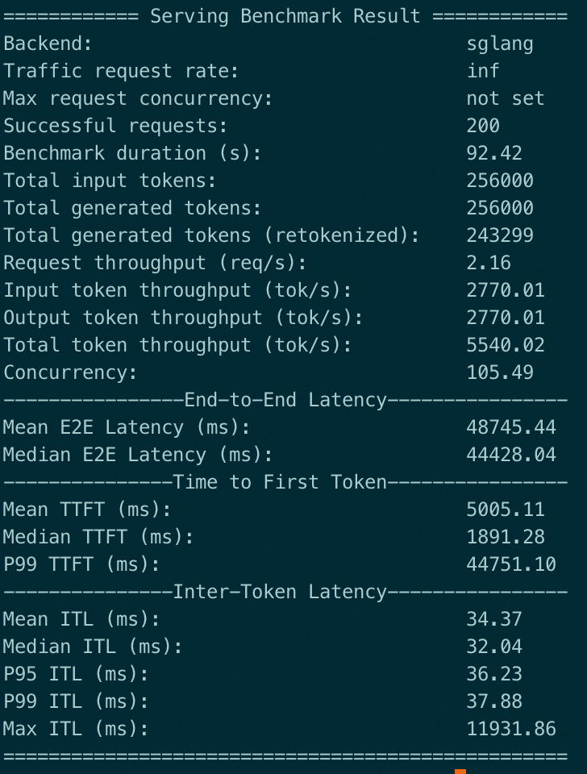
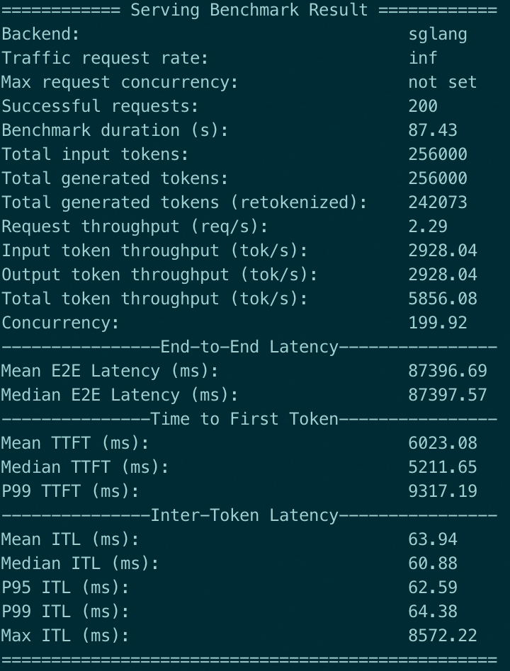

# Evaluation for PoC

## Summary

With the functionality limitations of current PoC, the latency and throughput performance of AFD is mostly worse than non-AFD. But it shows the advantage of larger concurrency, which can be beneficial for GPU utilization and throughput in some cases, especially during Decoding.

We consider better distribution support as future work, such as AFD with parallelism and/or PD disaggration, which will boost the benefit of AFD.

## Latency

Test Qwen3-30B-A3B with `bench_one_batch_server`:
* non-AFD (baseline): 1 GPU without any parallelism
* AFD: 2 GPUs at different nodes connected with 200Gbps RDMA
* Limited by the current implementation, overlapped schedule and cuda graph are disabled

cmd:
```shell
# repeat for 3 times
python -m sglang.bench_one_batch_server --model-path <model> --base-url <url> --batch-size 1 --input-len 4096 --output-len 100 --show-report
```

### non-AFD (baseline)

| batch size | latency (s) | input throughput (tok/s) | output throughput (tok/s) | TTFT (s) | ITL (ms) | input cost ($/1M) | output cost ($/1M) |
| ---------- | ----------- | ------------------------- | ------------------------- | ---------- | -------- | ----------------- | ------------------ |
| 1 | 3.51 | 18519.90 | 30.37 | 0.22 | 32.93 | 0.04 | 18.29 |
| 1 | 3.40 | 33014.14 | 30.53 | 0.12 | 32.76 | 0.02 | 18.20 |
| 1 | 3.39 | 35886.74 | 30.52 | 0.11 | 32.77 | 0.02 | 18.21 |

### AFD

| batch size | latency (s) | input throughput (tok/s)  | output throughput (tok/s) | TTFT (s) | ITL (ms) | input cost ($/1M) | output cost ($/1M) |
| ---------- | ----------- | ------------------------- | ------------------------- | ---------- | -------- | ----------------- | ------------------ |
| 1 | 3.77 | 16967.89 | 28.36 | 0.24 | 35.27 | 0.05 | 19.59 |
| 1 | 3.77 | 17157.20 | 28.28 | 0.24 | 35.36 | 0.05 | 19.64 |
| 1 | 3.77 | 16933.58 | 28.34 | 0.24 | 35.28 | 0.05 | 19.60 |

> We replace the reported `acc length` results with `TTFT(s)` in the above tables.

### Analysis

The ITL of AFD is about 2.5 ms larger, and the TTFT is about 120 ms larger.

Given AFD induces network communication overhead in this case, the larger latency of AFD is thought to be kind of reasonable. And we are working on further optimization for StepMesh.

There are 48 layers, and 2 send-recvs (A2F and F2A) for each layer. So there are 96 send-recvs in total, and the hidden size is 2k.
For each send-recv in decoding the time used is ~26 us, and in prefilling the time used is ~1.25 ms (~4096 tokens or ~16 MB at a time, so the efficient bandwidth is ~13 GBps).

Note that the communication time can be overlapped with multiple microbatches (especially for decoding), so therotically this does no harm to the throughput.

## Throughput

The configuration is same as latency test, except that:
* `--chunked-prefill-size` and `--max-prefill-tokens` are increased to 32768, to make larger global batch size for AFD overlap (it does not affect the non-AFD performance during our test)
* For non-AFD, we add `--dp 2` so that the GPU number is same

cmd:
```shell
python -m sglang.bench_serving --port 30000 --backend sglang --dataset-name random-ids --random-range-ratio 1 --random-input-len 1280 --random-output-len 1280 --num-prompt 200
```
### non-AFD (baseline)



### AFD



### Analysis

|                                | non-AFD (baseline) | AFD |
| ------------------------------ | ----------- | ----------- |
| Total token throughput (tok/s) | 5540.02  | 5856.08  |
| Median TTFT (ms)               | 1891.28  | 5211.65  |
| P99 TTFT (ms)                  | 44751.10 | 9317.19  |
| Mean ITL (ms)                  | 34.37    | 63.94    |
| Mean E2E Latency (ms)          | 48745.44 | 87396.69 |

Some key results are shown in the table above:

* The total token throughput is 5.7% higher because the difference of concurrency: limited by KV-cache capacity, the non-AFD concurrency is about half of that of AFD. (In our case, the `max_total_num_tokens` is ~212k for a non-AFD DP rank, while ~802k for AFD thanks to the much lower memory usage of Attention blocks)
* The larger concurrency also provides smaller P99 TTFT.
* TTFT, ITL, and E2E latency are all larger for AFD. The reason for larger TTFT is the high communication overhead, similar with the latency test. The ITL is expected to be larger because the input global batch is split into multiple microbatches. However, because the workload is unbalanced between Attn and FFN, one of them becomes the bottleneck. In our case the FFN takes up most of the time (~50 ms vs ~35 ms for Attn) and thus becomes the bottleneck.

Future work to improve the performance:
* Better parallelism support such as attention DP to balance the workload between Attn and FFN. This also helps to evaluate larger real-world models.
* Enable AFD only in Decoding stage through PD Disaggration.

## Accuracy

Since the microbatch overlap mechanism changes the model forwarding path, we test the accuracy using `sglang.test.few_shot_gsm8k`. The configuration is same as latency test.

> ref: [SGLang: Test the accuracy](https://docs.sglang.ai/developer_guide/contribution_guide.html#test-the-accuracy)

Repeat 3 times for each test.

|  | 1 | 2 | 3 |
| ---------- | ----------- | ----------- | ------------------------- |
| non-AFD (baseline) | 0.880 | 0.880 | 0.875 |
| AFD | 0.840 | 0.830 |0.860 |

The variance is less than 5%.
